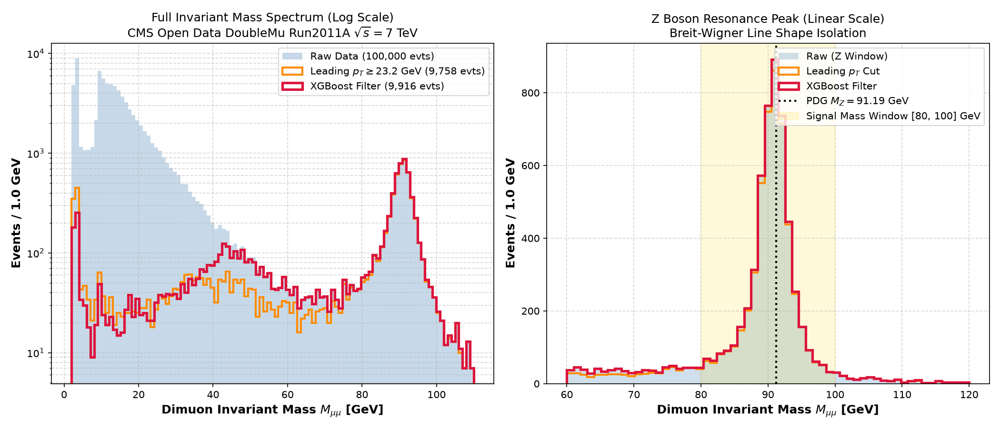
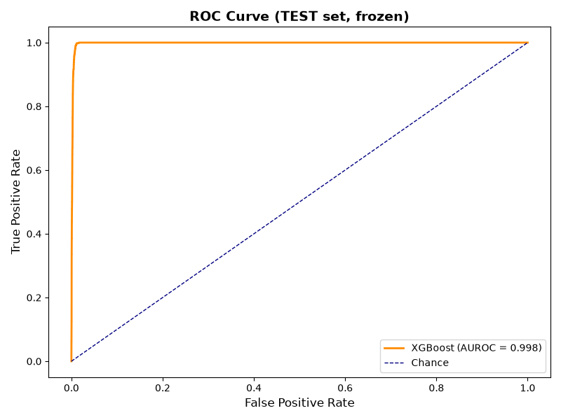
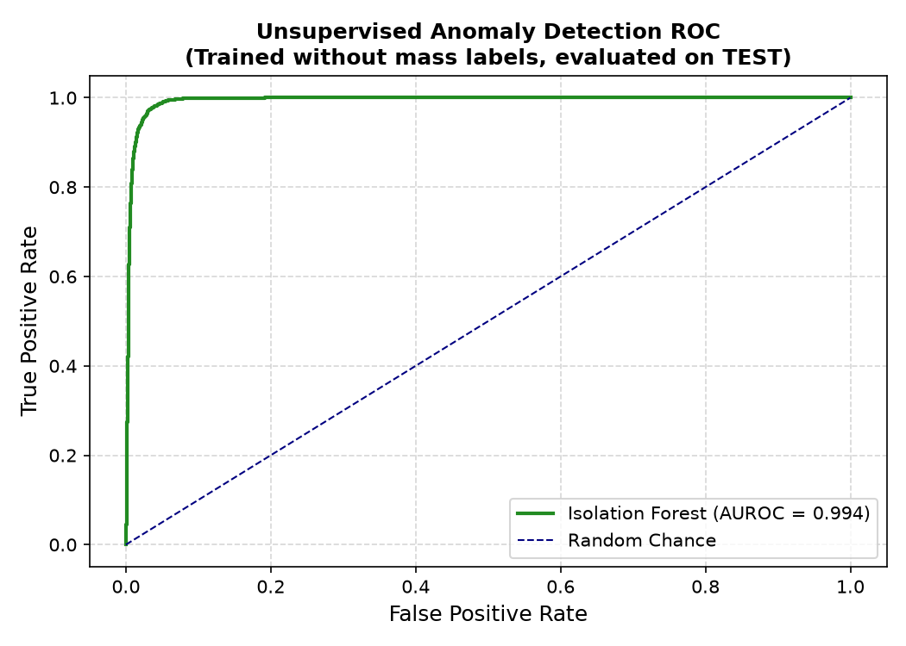
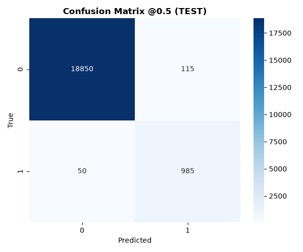
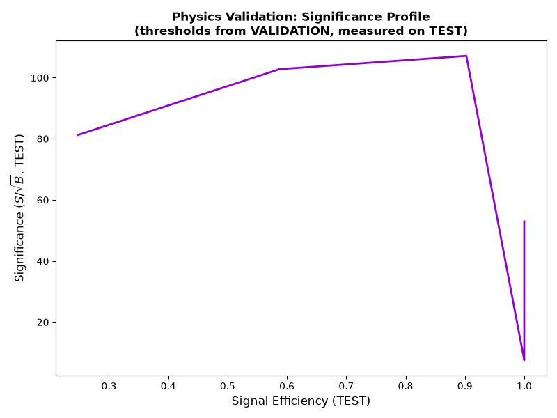
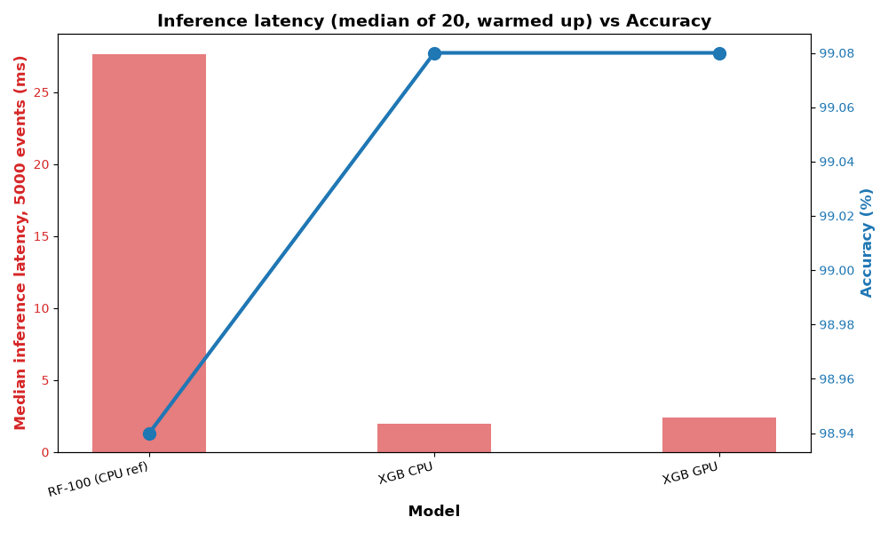

# Machine Learning-Based Detection of Z Boson Signals using CERN Open Data


> **Scope:** High-energy physics demonstration of filtering $Z \to \mu^+\mu^-$ collision events from continuum background using CMS Open Data. Features supervised kinematic classification (XGBoost), unsupervised trigger anomaly detection (Isolation Forest), geometric deep learning (PyTorch Geometric GCN), and an interactive Streamlit trigger dashboard.

---

## ⚡ Interactive Web Dashboard (`app.py`)

Run the real-time filtering application locally:
```bash
streamlit run app.py
```
- **Live Threshold Tuning**: Adjust physics baseline cuts ($p_T^{\text{lead}}$) and ML probability thresholds with real-time Breit-Wigner mass peak updates.
- **Microsecond Trigger Emulation**: Simulates LHC High-Level Trigger (HLT) burst processing with latency stability monitoring and throughput meters.
- **Kinematic Visualizer**: Interactive transverse momentum correlation ($p_{T1}$ vs $p_{T2}$) and angular opening topology ($\Delta\phi \approx \pi$).

---

## 🔬 Physics Invariant Mass Reconstruction

Dimuon invariant mass is reconstructed from collision kinematics:
$$M_{\mu\mu} = \sqrt{2 p_{T1} p_{T2} (\cosh(\eta_1 - \eta_2) - \cos(\phi_1 - \phi_2))}$$


*Left: Global invariant mass spectrum (2–110 GeV, log scale) isolating the Z peak from the low-mass Drell-Yan continuum. Right: Linear-scale zoom into the $Z \to \mu^+\mu^-$ resonance ($M_Z = 91.19\text{ GeV}$) comparing raw collisions, baseline leading-$p_T$ cut, and XGBoost kinematic filter.*

---

## 📊 Benchmark Results (Full 100,000 Collision Events)

**Protocol**: Stratified 60/20/20 train/val/test split. Thresholds are calibrated on TRAIN (baseline) or VALIDATION (ML) at a strict 5% background retention budget and measured once on frozen TEST (20,000 events, 5.17% signal fraction).

| Architecture | Training Paradigm | Signal Eff. @ 5% Background | AUROC | AUPRC | Test Acc@0.5 | Model Artifact |
|---|---|---|---|---|---|---|
| **Leading $p_T$ Cut** ($p_T^{\text{lead}} \ge 23.16\text{ GeV}$) | Physics Baseline Rule | `96.71%` | — | — | — | — |
| **XGBoost Classifier** | Supervised (Kinematics only) | **`100.00%`** | **`0.9981`** | **`0.9456`** | `99.17%` | `z_boson_xgb_model.joblib`, `.json` |
| **Isolation Forest** | Unsupervised Anomaly (No mass labels) | **`98.74%`** | **`0.9935`** | **`0.8424`** | — | `models/anomaly_detector.joblib` |
| **Graph Neural Network (GCN)** | Relational Graph (10 ep, full data) | — | **`0.9968`** | **`0.8979`** | `98.91%` | `models/gnn_prototype.pt` |

### Key Physics Findings
1. **Unsupervised Resonant Discovery**: When trained **strictly on background collisions without mass labels**, the Isolation Forest isolates **98.74% of Z-boson events** at a 5% false-positive rate, confirming that resonance events are detectable as kinematic outliers without circular label supervision.
2. **Kinematic vs Naive Cut**: Supervised ML achieves **100% signal efficiency** at 4.87% background retention, outperforming the leading-$p_T$ physics cut by **+3.29 percentage points**.

---

## 📈 Performance & ROC Visualizations

<p align="center">
  
  
</p>
<p align="center">
  <em>Left: Frozen test ROC curve for supervised XGBoost (AUROC = 0.998). Right: Test ROC curve for unsupervised Isolation Forest trained without mass labels (AUROC = 0.994).</em>
</p>

<p align="center">
  
  
</p>
<p align="center">
  <em>Left: Test confusion matrix @ 0.5 threshold (TN=18,850, FP=115, FN=50, TP=985). Right: Physical significance profile ($S/\sqrt{B}$) evaluated across monotonic validation thresholds.</em>
</p>

---

## ⏱️ Real-Time Inference Latency Benchmark

Measured on identical 20,000-event test slices (warmup + median & p95 latency):



| Model | Training Time | Inference Latency (Median) | Latency (p95) | Accuracy |
|---|---|---|---|---|
| **Random Forest (100 trees, CPU ref)** | ~1.10 s | ~27.7 ms | ~39.5 ms | 98.94% |
| **XGBoost CPU** | ~0.29 s | **~2.00 ms** | **~2.38 ms** | 99.08% |
| **XGBoost GPU (CUDA)** | ~0.35 s | **~2.41 ms** | **~2.74 ms** | 99.08% |

---

## 📂 Project Structure

```text
├── Dimuon_DoubleMu.csv       # Tracked official dataset (record 5201, 100k events)
├── Dimuon_DoubleMu.root      # Local binary ROOT TTree format for high-speed I/O
├── app.py                    # Interactive Streamlit dashboard for real-time trigger & spectrum tuning
├── Dockerfile                # Production container deployment
├── requirements.txt          # Production dependencies
├── requirements-lock.txt     # Pinned deterministic dependency lock
├── src/
│   ├── _compat.py            # UTF-8 stdout guard & repo-root input lookup
│   ├── data_download.py      # Resilient dataset download & ROOT conversion
│   ├── train_model.py        # Stratified 60/20/20 XGBoost with JSON export
│   ├── train_gnn.py          # 2-node dimuon GCN (StandardScaler normalized, train/val/test)
│   ├── plot_mass_spectrum.py # Dimuon invariant mass spectrum & Breit-Wigner peak isolation
│   ├── anomaly_detection.py  # Unsupervised Isolation Forest trigger on kinematics
│   ├── realtime_simulation.py# Offline burst replay with TP/FP/FN/TN + latency accounting
│   ├── speed_analysis.py     # XGB-CPU vs XGB-GPU vs RF benchmark
│   ├── stress_test_gpu.py    # Synthetic saturation stress test
│   └── baseline_physics_cut.py# Deterministic mass-cut ceiling reference
├── tests/
│   └── test_pipeline.py      # 14 automated pytest unit tests (100% pass)
├── models/
│   ├── z_boson_xgb_model.json# Production C++ / Triton native model export
│   ├── anomaly_detector.joblib# Unsupervised Isolation Forest pipeline
│   └── gnn_prototype.pt      # Geometric deep learning weights & scaler
├── plots/                    # Invariant mass, ROC, confusion matrix, and latency figures
└── results/
    ├── metrics.md            # Benchmark report for supervised & baseline models
    └── anomaly_metrics.md    # Benchmark report for unsupervised anomaly detection
```

---

## 🚀 Getting Started

### 1. Interactive Dashboard (Streamlit)
```bash
streamlit run app.py
```

### 2. Local Training & Execution
```bash
# Install dependencies
pip install -r requirements.txt

# Run the complete test suite (14 tests)
python -m pytest tests/test_pipeline.py -v

# Train Supervised XGBoost + Export native JSON
python src/train_model.py

# Train Unsupervised Trigger Anomaly Detector
python src/anomaly_detection.py

# Train Graph Neural Network on Full Dataset
python src/train_gnn.py --full --epochs 10

# Reconstruct Invariant Mass Spectrum
python src/plot_mass_spectrum.py

# Run Latency & Speed Analysis
python src/speed_analysis.py

# Replay Real-Time Trigger Emulation
python src/realtime_simulation.py
```

### 3. Docker Container
```bash
docker build -t cern-zboson-ml .
docker run --rm cern-zboson-ml python src/realtime_simulation.py
```

---

## 📡 Data Source

- **Portal**: [CERN Open Data Portal — CMS DoubleMu Run2011A 7 TeV (Record 5201)](https://opendata.cern.ch/record/5201)
- **Parent Record**: [Derived Datasets from Run2011A (Record 545)](https://opendata.cern.ch/record/545)
- **License**: Dataset released under Creative Commons CC0. Project source code released under MIT License.
