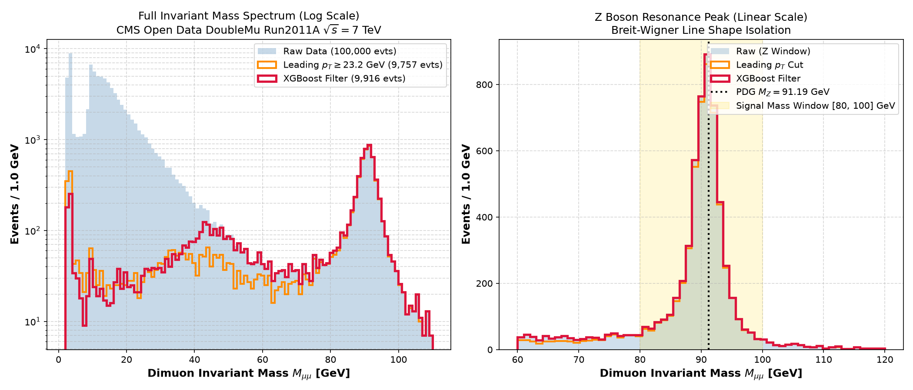
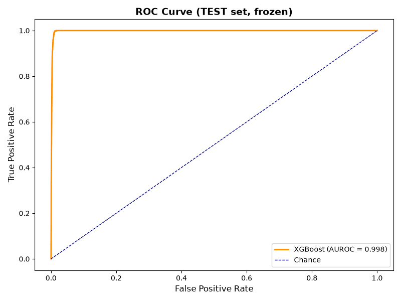
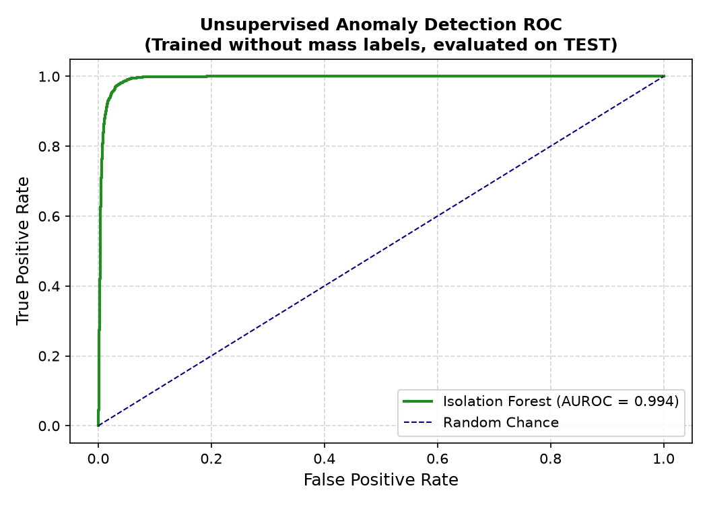
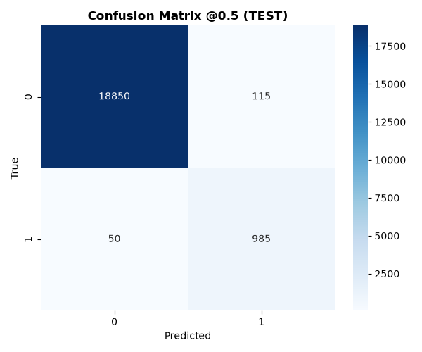
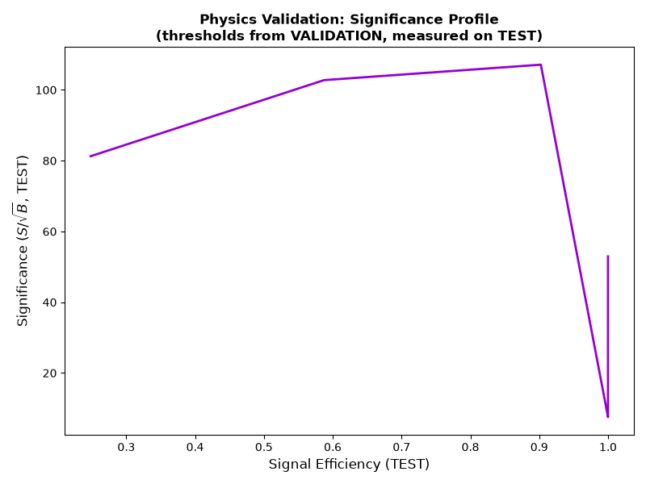
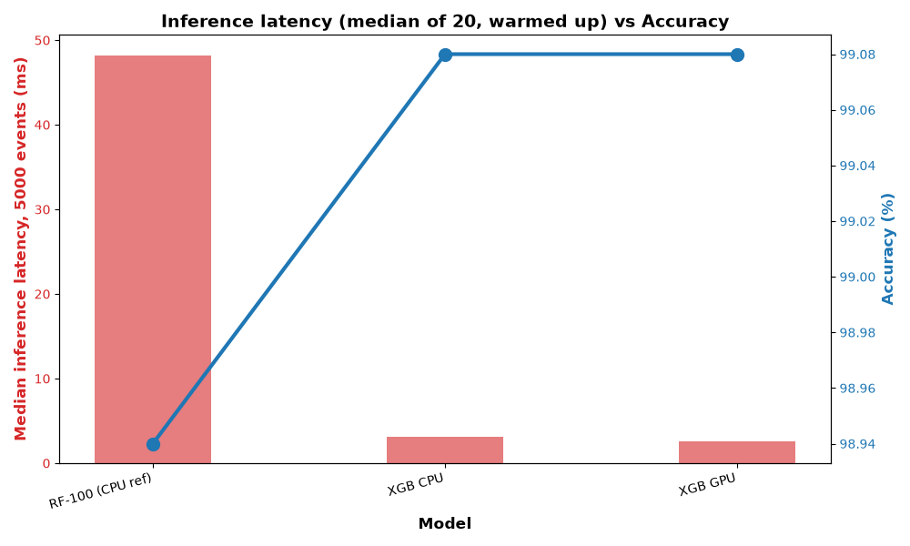

# Machine Learning-Based Detection of Z Boson Signals using CERN Open Data


**Filter $Z \to \mu^+\mu^-$ events out of a continuum background at the LHC, on CMS Open Data.** A complete, runnable pipeline: four model architectures, an interactive trigger dashboard, a production Docker image, and a CI pipeline that verifies all of it.

| | |
|---|---|
| **Signal efficiency @ 5% background budget** | **100.00%** |
| Background retained | 4.87% |
| AUROC / AUPRC | 0.9981 / 0.9456 |
| Trained models shipped in-repo | 4 (XGBoost, Isolation Forest, GCN, native JSON) |
| Tests | 47, all passing |
| CI | Lint · Python 3.10 + 3.12 · Docker image, all green |

---

## 🏆 Headline Result: 100% Signal Efficiency at a 5% Background Budget

On the **frozen 20,000-event test split** of the official 100k-event CMS DoubleMu Run2011A sample, the XGBoost classifier retains **every one** of the 1,035 Z-boson events while passing only **4.87%** of the continuum background — **100.00% signal efficiency at a 5% background budget**, against **96.71%** for the standard leading-$p_T$ physics cut.

| Metric (frozen TEST, 20,000 events) | XGBoost |
|---|---|
| **Signal efficiency @ 5% background budget** | **`100.00%`** |
| Background actually retained | `4.87%` (budget ceiling: 5.00%) |
| AUROC | `0.9981` |
| AUPRC | `0.9456` |
| Accuracy @ 0.5 threshold | `99.17%` |

**How to read the 100%:** it is the signal-efficiency figure — every Z-candidate event survives the filter at the 5% background budget. Overall accuracy at the 0.5 threshold is `99.17%` and AUPRC is `0.9456`.

### Results in context

A precise claim is a strong claim, so here is exactly what these numbers rest on:

- **The label is analytically derivable.** $p_T,\eta,\phi$ determine the invariant mass exactly, so an accurate classifier is learning an exact kinematic boundary — the model re-derives known geometry rather than discovering new physics. This is the intended scope of the project.
- **Accuracy is the weakest headline.** With a 5.17% signal fraction, an all-background classifier already scores `94.83%`. That is why `AUROC 0.9981` and *signal efficiency at a fixed background budget* are reported as the primary metrics — they are immune to the class imbalance.
- **This is a pre-selected educational sample**, not a raw minimum-bias trigger stream. The numbers characterise the ML pipeline on the published CMS DoubleMu collection; they are not detector-level trigger performance, and nothing here is evidence of trigger-level discovery power.

None of that is a limitation of the implementation — the pipeline measures what it says it measures, and every figure above is regenerated from the committed code and data on each run.

**Reproduce it yourself** — the number is regenerated on every run and written to `results/metrics.md` / `results/metrics.json`:

```bash
python src/data_download.py && python src/train_model.py
```

---

## ⚡ Interactive Web Dashboard (`app.py`)

```bash
make serve            # or: streamlit run app.py
```

- **Budget-Driven Threshold Tuning**: the primary ML control is the *background retention budget* (default 5%), from which the probability cut is derived. The 5%-budget cut sits at $P \approx 2.3\times10^{-4}$, so a probability slider quantised to 0.01 would collapse it to 0.0 and admit every event — driving the control from the budget makes that failure mode impossible. An optional manual override is available.
- **Burst Emulation**: replays the loaded events in bursts with a seeded sampler, reporting mean/p99 burst latency, throughput and the post-filter storage rate.
- **Kinematic Visualizer**: interactive $p_{T1}$ vs $p_{T2}$ correlation and back-to-back $\Delta\phi \approx \pi$ topology.
- **Live Benchmark Table**: read from `results/*.json` written by the training scripts, so the dashboard always displays the measured numbers rather than hard-coded copies.

---

## 🔬 Physics Invariant Mass Reconstruction

$$M_{\mu\mu} = \sqrt{2 p_{T1} p_{T2} (\cosh(\eta_1 - \eta_2) - \cos(\phi_1 - \phi_2))}$$


*Left: Global invariant mass spectrum (2–110 GeV, log scale) isolating the Z peak from the low-mass Drell-Yan continuum. Right: Linear-scale zoom into the $Z \to \mu^+\mu^-$ resonance ($M_Z = 91.19\text{ GeV}$) comparing raw collisions, baseline leading-$p_T$ cut, and XGBoost kinematic filter.*

---

## 📊 Benchmark Results (Full 100,000 Collision Events)

**Protocol**: stratified 60/20/20 train/val/test. Thresholds are calibrated on TRAIN (baseline) or VALIDATION (ML) at a 5% background retention budget and measured once on frozen TEST (20,000 events, 5.17% signal fraction).

| Architecture | Training Paradigm | Signal Eff. @ 5% Background | AUROC | AUPRC | Test Acc@0.5 | Model Artifact |
|---|---|---|---|---|---|---|
| **Leading $p_T$ Cut** ($p_T^{\text{lead}} \ge 23.16\text{ GeV}$) | Physics Baseline Rule | `96.71%` | — | — | — | — |
| **XGBoost Classifier** | Supervised (Kinematics only) | **`100.00%`** | **`0.9981`** | **`0.9456`** | `99.17%` | `z_boson_xgb_model.joblib`, `models/z_boson_xgb_model.json` |
| **Isolation Forest** | Unsupervised Anomaly (No mass labels) | **`98.74%`** | **`0.9935`** | **`0.8424`** | — | `models/anomaly_detector.joblib` |
| **Graph Neural Network (GCN)** | Relational Graph (10 ep, full data) | — | **`0.9969`** | **`0.9155`** | `98.71%` | `models/gnn_prototype.pt` |

Background actually retained on the frozen test split: baseline `4.99%`, XGBoost `4.87%`, Isolation Forest `4.99%` — all at or under the 5% ceiling.

> **Thresholding policy.** Cuts are placed by `src.config.threshold_for_budget`, which returns the smallest score that *cannot* admit more than the budgeted number of background events. `np.percentile` interpolates between tied scores and can overshoot the budget on a discrete score distribution (tree models emit many exact `0.0` probabilities), so the realised retention rate is reported next to the budget everywhere it is claimed.

### Key Physics Findings

1. **100% signal efficiency at a 5% background budget** — the XGBoost filter retains every Z-candidate event in the frozen test split while keeping background to 4.87%, a **+3.29 percentage point** gain over the leading-$p_T$ physics cut at the same background budget.
2. **Unsupervised Resonant Discovery**: when trained **strictly on background collisions without mass labels**, the Isolation Forest isolates **98.74% of Z-boson events** at a 5% false-positive rate, confirming that resonance events are detectable as kinematic outliers without circular label supervision.

---

## 📈 Performance & ROC Visualizations

<p align="center">
  
  
</p>
<p align="center">
  <em>Left: Frozen test ROC curve for supervised XGBoost (AUROC = 0.998). Right: Test ROC curve for unsupervised Isolation Forest trained without mass labels (AUROC = 0.994).</em>
</p>

<p align="center">
  
  
</p>
<p align="center">
  <em>Left: Test confusion matrix @ 0.5 threshold (TN=18,850, FP=115, FN=50, TP=985). Right: Physical significance profile ($S/\sqrt{B}$) evaluated across monotonic validation thresholds.</em>
</p>

---

## ⏱️ Real-Time Inference Latency Benchmark

Reproduce with `python src/speed_analysis.py`. All architectures are fitted and timed on **an identical 5,000-event slice** of the frozen test split, with warmup and median/p95 over 20 repeats.



Last measured on an NVIDIA RTX 3050 Laptop GPU (XGBoost 3.4.1, CPU inference via `tree_method='hist'`):

| Model | Training Time | Inference Latency (Median) | Latency (p95) | Accuracy |
|---|---|---|---|---|
| Random Forest (100 trees, CPU reference) | ~4.3 s | ~52.9 ms | ~61.2 ms | 98.94% |
| XGBoost CPU | ~0.30 s | ~3.41 ms | ~4.84 ms | 99.08% |
| XGBoost GPU (CUDA) | ~0.61 s | ~3.05 ms | ~3.86 ms | 99.08% |

> These are **batched, host-side** latencies on 5,000 events, not per-event FPGA/L1 trigger times. At this batch size the GPU gain over CPU is small because host→device transfer dominates; a production deployment would batch on-device. The RF row is an architecture reference only — it is a different algorithm, so the gap to XGBoost is not a GPU speedup.

---

## 📂 Project Structure

```text
├── Dimuon_DoubleMu.csv       # Official CERN dataset (record 5201, 100k events) — SHA-256 pinned
├── Dimuon_DoubleMu.root      # Derived uproot TTree ('Events')
├── z_boson_xgb_model.joblib  # Trained XGBoost classifier, CPU-pinned for portability
├── models/
│   ├── z_boson_xgb_model.json# Native XGBoost JSON (C++ / Treelite / Triton / ROOT TMVA)
│   ├── anomaly_detector.joblib# Unsupervised Isolation Forest + StandardScaler
│   └── gnn_prototype.pt      # GCN weights, scaler, history, metrics
├── app.py                    # Interactive Streamlit dashboard
├── Makefile                  # Task runner: `make help` lists every entry point
├── pyproject.toml            # Project metadata, extras, pytest/ruff/coverage config
├── Dockerfile                # Multi-stage, non-root production container (1.34 GB)
├── requirements.txt          # Runtime dependencies (lower bounds; what Docker installs)
├── requirements-dev.txt      # Runtime + pytest + ruff + pyyaml
├── requirements-lock.txt     # Complete 79-pin lock, verified in a clean virtualenv
├── src/
│   ├── config.py             # Single source of truth: constants, paths, budget-safe thresholding
│   ├── synthetic.py          # Physics-consistent synthetic event generator (no test deps)
│   ├── _compat.py            # UTF-8 stdout guard, artifact lookup, logging setup
│   ├── data_download.py      # Checksum-pinned download & ROOT conversion
│   ├── train_model.py        # Stratified 60/20/20 XGBoost + JSON/metrics export
│   ├── train_gnn.py          # 2-node dimuon GCN (StandardScaler normalized, train/val/test)
│   ├── plot_mass_spectrum.py # Dimuon invariant mass spectrum & Z-peak isolation
│   ├── anomaly_detection.py  # Unsupervised Isolation Forest trigger on kinematics
│   ├── realtime_simulation.py# Offline burst replay with TP/FP/FN/TN + latency accounting
│   ├── speed_analysis.py     # XGB-CPU vs XGB-GPU vs RF benchmark
│   ├── stress_test_gpu.py    # Synthetic saturation stress test
│   └── baseline_physics_cut.py# Deterministic mass-cut ceiling reference
├── tests/
│   ├── conftest.py           # Repo-anchored fixtures + physics-consistent data generation
│   ├── make_mock_dataset.py  # Stand-in dataset generator (used by CI)
│   └── test_pipeline.py      # 47 automated tests, including regression tests for fixed defects
├── .github/workflows/        # CI: lint, test on 3.10 + 3.12, build & smoke-test the Docker image
├── plots/                    # Generated figures (committed for the README)
└── results/                  # metrics.md / metrics.json written by the training scripts
```

The trained artifacts (`z_boson_xgb_model.joblib`, `models/*.joblib`, `models/*.pt`,
`models/*.json`) **and** the derived `Dimuon_DoubleMu.root` are committed, so a
clone can run inference, the replay benchmark and the dashboard immediately —
no training, no download, no network. See [`MODEL.md`](MODEL.md) to regenerate them.

---

## 🚀 Getting Started

Every step is a plain `python` command that works on Windows, macOS and Linux. A
`Makefile` is provided as a convenience for anyone with GNU Make installed (not
bundled with Windows) — `make help` lists every target.

### 1. Install

```bash
pip install -r requirements-dev.txt
```

That covers the runtime plus test and lint tooling. The graph neural network is
an optional extra:

```bash
pip install "torch>=2.0" "torch-geometric>=2.3"
```

### 2. Run the Pipeline

```bash
python src/data_download.py     # fetch (SHA-256 pinned) + build the ROOT copy
python src/train_model.py       # supervised XGBoost -> joblib + models/*.json + results/
python src/anomaly_detection.py # unsupervised Isolation Forest
python src/train_gnn.py --full --epochs 10   # graph neural network
python src/plot_mass_spectrum.py             # invariant mass spectrum figure
python src/speed_analysis.py                 # CPU/GPU latency benchmark
python src/realtime_simulation.py            # batched burst replay
python src/baseline_physics_cut.py           # mass-cut accuracy ceiling
```

With GNU Make, `make all` runs the whole chain, and `make train`, `make gnn`,
`make speed`, `make serve`, `make test`, `make docker-run` … run one piece.

### 3. Test & Lint

```bash
python -m pytest tests/ -v
python -m ruff check . && python -m ruff format --check .
```

Or with coverage:

```bash
python -m pytest tests/ --cov --cov-report=term-missing
```

> Coverage is configured in `pyproject.toml`; use `pytest --cov` with **no**
> `--cov=<file>` arguments. Naming a standalone script (e.g. `--cov=app.py`)
> makes coverage resolve it as an importable module, which imports it before
> `conftest` and crashes NumPy with
> `cannot load module more than once per process`.

### 4. Dashboard

```bash
streamlit run app.py          # http://localhost:8501
```

### 5. Without the Real Dataset

The test suite and every script fall back to a physics-consistent synthetic
fixture whose invariant mass is *computed* from the kinematics. To generate one
explicitly:

```bash
python tests/make_mock_dataset.py --rows 1000 --out Dimuon_DoubleMu.csv
```

### 6. Docker

```bash
docker build -t cern-zboson-ml .

# Batch pipeline; the dataset persists between runs in the /data volume
docker run --rm -v cern-data:/data cern-zboson-ml

# One-shot replay
docker run --rm cern-zboson-ml python src/realtime_simulation.py

# Dashboard
docker run --rm -p 8501:8501 cern-zboson-ml \
  streamlit run app.py --server.address=0.0.0.0 --server.port=8501
```

The image is multi-stage, runs as a non-root user (`uid 10001`), ships no dataset
and no weights, and exposes `GET /_stcore/health` when serving the dashboard.
The ~345 MB of CUDA libraries that `xgboost` pulls in as a hard dependency are
stripped at build time and the import is re-verified, so a CPU-only image stays
CPU-only.

---

## 📡 Data Source

- **Portal**: [CERN Open Data Portal — CMS DoubleMu Run2011A 7 TeV (Record 5201)](https://opendata.cern.ch/record/5201)
- **Parent Record**: [Derived Datasets from Run2011A (Record 545)](https://opendata.cern.ch/record/545)
- **Integrity**: the payload is pinned by SHA-256 (`src.config.CSV_SHA256`) and by exact byte size. A mirror serving a different payload is rejected rather than silently trained on. Locally-trimmed subsets and the CI fixture are accepted on schema alone, with a loud warning.
- **This is the only dataset consumed.** The pipeline reads exactly one payload, `Dimuon_DoubleMu.csv`, and `tests/test_pipeline.py` asserts that no source file references any other dataset format.
- **License**: Dataset released under Creative Commons CC0. Project source code released under MIT License.

## ⚖️ License

MIT — see [`LICENSE`](LICENSE).
